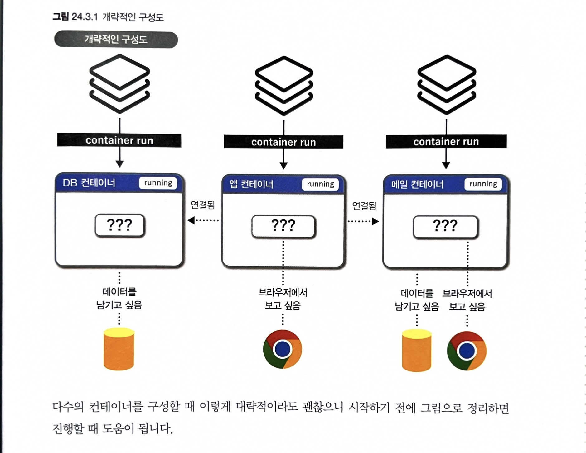
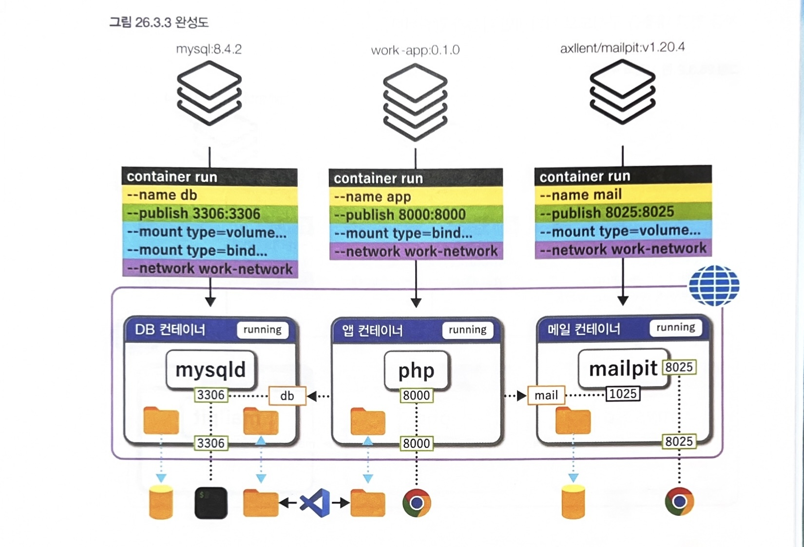

# 그림으로 배우는 도커
> 이 책을 읽게된 계기

도커를 업무적으로 사용하다보면 항상 쓰던 방법과 익숙한 방식으로만 사용하게 된다. 
그래서 한번쯤 리마인드 겸 기초부터 정리해보고 싶었고, 그러던 찰나 서점에서 괜찮아 보이는 도커 입문서가 있어서 읽게 되었다. 

## 9.1 컨테이너 포트 공개하기
```bash
# 백그라운드로 nginx 서버 실행
# -p -> --publish 와 동일
docker run -d --name nginx-test -p 8081:80 nginx
```

> 컨테이너 포트 관련

- 컨테이너 내부에서 사용하는 포트는 보통 이미지(애플리케이션)가 정해놓은 포트이고, 호스트 포트는 사용자가 지정한다.
- 예를 들어 nginx 이미지는 기본적으로 80 포트를 사용
```bash
docker run -d -p 8081:80 nginx
```
의 의미는
```bash
내 PC(또는 서버) 8081 포트
        ↓
컨테이너 내부 80 포트 (nginx)
```
- 컨테이너가 어떤 포트를 쓰는지 확인
```bash
docker inspect nginx-test
docker image inspect nginx
```

> 두 개의 포트가 필요한 이유?
- 같은 서버에서 여러 개를 띄울 수 있기 때문. 예를들어
```bash
docker run -d --name web1 -p 8081:80 nginx
docker run -d --name web2 -p 8082:80 nginx
docker run -d --name web3 -p 8083:80 nginx
```
모든 컨테이너는 내부적으로 80 포트를 사용하지만
```bash
서버:8081 → web1:80
서버:8082 → web2:80
서버:8083 → web3:80
```
로 구분해서 접근한다.

- 터미널에서 MYSQL 컨테이너의 서버 접속
```bash
mysql --host=192.168.64.5 --port=3306 --user=app --password=pass1234 sample
```

## 11.2 가동 중인 컨테이너에 명령하기
> docker run VS docker exec 차이점

### run

```bash
docker run nginx
```

결과:

```
새 nginx 컨테이너 생성
```

### exec

```bash
docker exec nginx-test nginx-v
```

결과:

```bash
nginx version: nginx/1.31.1
```

이미 떠있는 `nginx-test` 안에서 명령만 실행.

### 자주 쓰는 명령

#### 컨테이너 생성

```bash
docker run -d --name mysql mysql
```

#### 컨테이너 내부 접속

```bash
docker exec -it mysql bash
```

#### 로그 확인

```
docker logs mysql
```

#### 컨테이너 종료

```bash
docker stop mysql
```

실무에서는 보통:

```bash
docker run ...
```

으로 컨테이너를 띄우고,

문제 분석이나 설정 확인할 때

```bash
docker exec -it 컨테이너명 bash
```

로 내부에 들어가서 작업하는 경우가 가장 많다

## 11.3 PostgreSQL 서버에 접속하는 방법
- exex를 활용하면 아래와 같이 컨테이너 내부에서 PostgreSQL 서버에 접속이 가능하다.
```bash
docker exec -it postgres psql --host=127.0.0.1 --port=5432 --username=postgres
```

## 15.2 컨테이너 이미지화하기
- container commit을 사용하면 컨테이너에서 이미지를 만들 수 있다. 컨테이너에서 발생한 파일 시스템 변경을 포함한 이미지를 작성한다.
    - 예를 들면 기존 이미지에는 vim 설치가 되어있지 않았는데 이미지를 받은 후 컨테이너 내부에서 vim 설치 후 이미지를 다시 작성하면 vim 이 설치되어있는 이미지가 되는 것이다.

예를 들어 `ubuntu:24.04` 이미지를 받아서 컨테이너를 실행했다고 가정해보자.

### 1. 원본 이미지로 컨테이너 실행

```bash
docker run -it --name myubuntu ubuntu:24.04 /bin/bash
```

현재 상태

```
이미지 : ubuntu:24.04
 └─ 컨테이너 : myubuntu
```

---

### 2. 컨테이너 내부에서 vim 설치

컨테이너 안에서:

```bash
apt update
apt install -y vim
```

설치 확인:

```bash
vim --version
```

이제 `myubuntu` 컨테이너에는 vim이 설치되어 있음.

하지만 원본 이미지인 `ubuntu:24.04`는 변하지 않음.

---

### 3. 컨테이너를 이미지로 저장(commit)

컨테이너 밖으로 나와서:

```bash
docker commit myubuntu myubuntu:vim
```

확인:

```
docker images
```

결과 예시:

```
REPOSITORY   TAG      IMAGE ID
ubuntu       24.04    a1b2c3d4
myubuntu     vim      e5f6g7h8
```

---

### 4. 새 이미지로 컨테이너 실행

```bash
docker run -it myubuntu:vim /bin/bash
```

확인:

```bash
vim --version
```

바로 실행됨.

왜냐하면 이미 이미지 안에 vim이 포함되어 있기 때문.

---

> 그림으로 보면

```
ubuntu:24.04
    │
    └── docker run
            │
            ▼
      myubuntu 컨테이너
            │
            ├─ apt install vim
            │
            ▼
      docker commit
            │
            ▼
      myubuntu:vim 이미지
            │
            └─ docker run
                    │
                    ▼
           vim이 포함된 새 컨테이너
```

---

실무에서는 `docker commit`을 거의 사용하지 않고 보통 `Dockerfile`을 사용한다.

## 15.3 컨테이너를 tar로 이미지화하기

```bash
# 컨테이너에서 tar 아카이브 파일 작성하기
docker container export --output export.tar myubuntu

# 결과
export.tar 파일 생성
```

## 15.4 이미지를 tar로 만들고 다시 이미지화

```bash
# 이미지에서 tar 아카이브 파일 작성
docker image save --output save.tar ubuntu:22.04

# 결과
save.tar 생성

# tar 아카이브 파일에서 이미지 작성
docker image load --input save.tar

# 결과
ubuntu:22.04 이미지 생성
```

## 17.3 명령어를 실행해서 레이어 확정하기 RUN
```bash
# vi 명령어를 설치하는 Dockerfile
FROM ubuntu:24.04

RUN apt-get update
RUN apt-get install -y vim
```

- 도커 파일로 이미지 빌드하기
```bash
docker image build --tag my-ubuntu:24.04 .

# . 의미 : 현재 디렉토리를 빌드 컨텍스트로 사용(Dockerfile이 현재 디렉토리에 있다)
```

> RUN의 && 기호 활용

```bash
# RUN이 &&로 이어진 도커파일
FROM ubuntu:24.04

RUN apt-get update && apt-get install -y vim && rm -rf /var/lib/apt/lists/*
```

- RUN 명령어를 한개로 레이어를 합치는 이유 중 하나는 이미지 크기 줄이기이다.
- 위 명령어에서 apt 패키지 목록 캐시를 삭제하는데 `&&`로 합치면 한 레이어 안에서 생성 후 삭제하므로 최종 이미지에는 패키지 목록이 남지 않는다. 따라서 이미지 크기를 줄일 수 있다. 

```bash
# 빌드해서 이미지 크기 비교시

# 1레이어
docker image build --file Dockerfile-1layers --tag my-ubuntu:1layer .

# 3레이어
docker image build --file Dockerfile-3layers --tag my-ubuntu:3layer .

# 크기 비교
IMAGE                                ID             DISK USAGE   CONTENT SIZE   EXTRA
booksentinelv2-booksentinel:latest   d74bda613a2b       3.64GB         1.02GB        
my-ubuntu:1layer                     e0fc2240986b        245MB           52MB        
my-ubuntu:3layer                     d5239e128560        336MB         89.6MB
```

## 18.2 호스트머신의 파일을 이미지에 추가 COPY

### conf.d 사용

-  디렉토리 구조

```
project/
├── Dockerfile
└── custom.cnf
```

-  custom.cnf

```
[mysqld]
max_connections = 500
```

-  Dockerfile

```
FROM mysql:9.0.1

COPY ./custom.cnf /etc/mysql/conf.d/custom.cnf
```

빌드:

```
docker build-t my-mysql:9.0.1 .
```

실행:

```
docker run-d \
--name mysql \
-eMYSQL_ROOT_PASSWORD=1234 \
  my-mysql:9.0.1
```

---

왜 이게 더 안전할까?

MySQL 공식 이미지 내부에는 원래 이런 구조가 있다.

```
/etc/my.cnf
 └─ !includedir /etc/mysql/conf.d/
```

즉 MySQL이 시작될 때

1. `/etc/my.cnf` 읽음
2. `/etc/mysql/conf.d/*.cnf` 읽음
3. 설정 병합

따라서

```
COPY custom.cnf /etc/mysql/conf.d/custom.cnf
```

를 사용하면 기존 설정은 그대로 유지되고,

```
[mysqld]
max_connections=500
```

만 추가 적용된다.

## 19.1 컨테이너 가동 시 명령어 지정 - CMD
- 가동 시 명령어를 지정하는 Dockerfile
```bash
FROM python:3.12.5
CMD ["/usr/local/bin/python3", "-m", "http.server", "8000"]
```

- 작성한 Dockerfile로 이미지 작성
```bash
docker image build --tag my-python:web .
```

- 작성한 이미지 가동
```bash
docker run --name web --rm --detach -p 8000:8000 my-python:web
```

## 21.2 컨테이너 가동 시 볼륨 마운트
- 새로운 볼륨 작성 후 MySQL 컨테이너에 마운트
```bash
# 볼륨 작성하기
docker volume create --name db-volume

# MySQL 설정 파일 확인
docker container run --rm mysql:8.4.2 cat /etc/my.cnf
[mysqld]
datadir=/var/lib/mysql

# 볼륨을 마운트해서 MySQL 컨테이너 가동
docker run --name db1 --rm -d --env MYSQL_ROOT_PASSWORD=secret --env MYSQL_DATABASE=sample -p 3306:3306 --mount type=volume,source=db-volume,destination=/var/lib/mysql mysql:8.4.2

# 이후 MySQL 서버에서 create, insert 문으로 데이터 생성

# 컨테이너 정지 후 같은 볼륨을 마운트 
## 볼륨을 이용하므로 데이터는 이미 작성이 끝난 상태 -> 볼륨 데이터를 그대로 사용하도록 환경변수는 지정하지 않음
docker run --name db2 --rm -d -p 3306:3306 --mount type=volume,source=db-volume,destination=/var/lib/mysql mysql:8.4.2
```
> 데이터 확인 -> MySQL 서버 데이터가 그대로 남아 있음

## 22.2 볼륨과 바인드 마운트의 차이점
- 볼륨
    - 볼륨은 도커 엔진 관리에서 문제가 생겨도 호스트머신에 영향을 주지 않음
- 바인드마운트
    - 호스트머신과 컨테이너에서 디렉터리를 공유할수 있다. 호스트머신의 편집기로 파일을 편집해서 컨테이너에서 실행하는 개발 환경이라면 필수적인 방식.

## 23.2 컨테이너 가동 시 네트워크에 접속하기
- PHP 컨테이너에서 MySQL 컨테이너와 통신
```bash
# 네트워크 작성
docker network create my-network

# 네트워크를 지정해서 MySQL 컨테이너 가동
docker container run --mount type=bind,source="$(pwd)",destination=/my-work --network my-network my-php:pdo_mysql php /my-work/main.php

# 접속정보가 작성 된 main.php 파일 생성
$dsn = 'mysql:host=db;port=3306;dbname=sample';
$username = 'root';
$password = 'secret';
$pdo = new PDO($dsn, $username, $password);
```

---
> my-network 살펴보기
```bash
docker network inspect my-network

# 결과
"Containers": {
            "296cdd1985492fb3b62f7e243c126c75137a7b64a2f92e7f33d6d601b0069ff4": {
                "Name": "db",  # db 컨테이너 접속 중 
                "EndpointID": "485a76985d3e20dd9b844b53d7a6e1031f6c779453bd8bdf45f1a09924f14798",
                "MacAddress": "f2:79:34:aa:b4:1e",
                "IPv4Address": "172.18.0.2/16",
                "IPv6Address": ""
            }
},
```
---
> PHP 컨테이너 MySQL 컨테이너 통신 테스트
```bash
# 동일하게 my-network로 접속
docker container run --rm --mount type=bind,source="$(pwd)",destination=/my-work --network my-network my-php:pdo_mysql php /my-work/main.php
```
---
> 만약 PHP 컨테이너 가동 시 network 옵션을 주지 않는다면?
```
docker run \
  my-php:pdo_mysql \
  php /my-work/main.php
```

이 경우 PHP 컨테이너는 기본 bridge 네트워크에 붙음.

```
PHP 컨테이너 -> bridge
MySQL 컨테이너 -> my-network
```

서로 다른 네트워크. 그래서

```
host=mysql-db
```
를 찾을 수 없음.

## 25.1 웹 서비스 개발환경 구축

> 구성도 정리



- 컨테이너 테스트 및 run 매개변수 정리 후 아래와 같이 구성도를 완성한다.
> 최종 완성된 구성도


## docker 명령어를 compose.yml로 이식하기

- 도커 컴포즈는 다수의 컨테이너를 정의하고 실행하는 도구이다. yml(yaml) 파일에 정의한 내용에 따라 명령어 하나로 정의한 모든 컨테이너를 가동한다.

> compose.yml 파일
```bash
services:
  app:
    ports:
      - "8000:8000"
    volumes:
      - type: bind
        source: ./src
        target: /my-work
    build: ./docker/app # 기존의 Dockerfile을 사용한다 

  db:
    environment:
      - MYSQL_ROOT_PASSWORD=secret
      - MYSQL_USER=app
      - MYSQL_PASSWORD=pass1234
      - MYSQL_DATABASE=sample
      - TZ=Asia/Seoul
    ports:
      - "3306:3306"
    volumes:
      - type: volume
        source: db-compose-volume
        target: /var/lib/mysql

      - type: bind
        source: ./docker/db/init
        target: /docker-entrypoint-initdb.d
    image: mysql:8.4.2

  mail:
    environment:
      - TZ=Asia/Seoul
      - MP_DATA_FILE=/data/mailpit.db
    ports:
      - "8025:8025"
    volumes:
      - type: volume
        source: mail-compose-volume
        target: /data
    image: axllent/mailpit:v1.20.4


volumes:
  db-compose-volume:
  mail-compose-volume:
```
- 기본값으로 도커 컴포즈는 컨테이너를 가동할 때 브릿지 네트워크를 작성해서 모든 컨테이너를 해당 네트워크에 접속한다. 컨테이너는 서비스명을 이용해서 서로 통신한다.

> 가동
```bash
# Dockerfile 수정 시 재빌드
docker compose up --detach --build

# 일반실행
docker compose up -d
```

### 컨테이너 목록 확인
```bash
# compose가 있는 디렉토리 내에서
docker compose ps

# 결과
NAME                IMAGE                     COMMAND                  SERVICE   CREATED          STATUS                    PORTS
webservice-app-1    webservice-app            "docker-php-entrypoi…"   app       12 minutes ago   Up 12 minutes             0.0.0.0:8000->8000/tcp, [::]:8000->8000/tcp
webservice-db-1     mysql:8.4.2               "docker-entrypoint.s…"   db        12 minutes ago   Up 12 minutes             0.0.0.0:3306->3306/tcp, [::]:3306->3306/tcp, 33060/tcp
webservice-mail-1   axllent/mailpit:v1.20.4   "/mailpit"               mail      12 minutes ago   Up 12 minutes (healthy)   1025/tcp, 1110/tcp, 0.0.0.0:8025->8025/tcp, [::]:8025->8025/tcp
```

### 가동중인 컨테이너에 명령어 실행
```bash
docker compose exec db bash
```

### 모든 컨테이너 삭제
```bash
# down을 실행하면 네트워크, 컨테이너의 요소가 삭제된다.
docker compose down
```

### 모든 컨테이너, 이미지, 볼륨 삭제
```bash
docker compose down --rmi all --volumes
```
## 32.1 현재 상태 정리
- 상세 내용을 확인하는 명령어
```bash
docker container inspect work-db-1 # NAME

# Config.Cmd 란에서는 컨테이너 가동 시 기본 명령어 확인가능
"Cmd": [
    "/usr/local/bin/php",
    "--server",
    "0.0.0.0:8000",
    "--docroot",
    "/my-work"
],

# 네트워크 상세 내용
docker network inspect work_default
```