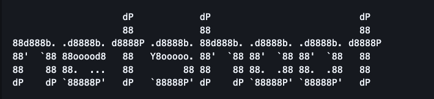

# Netshoot 

> 네트워크 문제를 진단하기 위한 도구들이 모두 들어있는 Docker 이미지

> 필요성

업무 특성상 폐쇄망 서버에서 작업을 하는 경우가 많은데 네트워크 상태를 확인하기 위해 명령어를 날리면 서버 자체에 `ping`, `curl`, `nc`등이 설치 되어있지 않은 경우가 종종 있다. 그러다보니 뭔가 방법이 없나 찾아보던중 네트워크 진단 도구만을 모아놓은 도커 이미지를 발견했다. 

## Docker Hub
https://hub.docker.com/r/nicolaka/netshoot

## GIT
https://github.com/nicolaka/netshoot

## Version
v0.15

## 실행
```bash
docker run --rm -it --net host --cap-add NET_ADMIN --cap-add NET_RAW <이미지>
```

- 설명
  - `--net host`: 컨테이너가 호스트의 네트워크를 그대로 사용하도록 함.
  - `--cap-add NET_ADMIN`: 네트워크 설정 조회 및 관리 권한을 추가.
  - `--cap-add NET_RAW`: ping과 같은 Raw Socket 기반 네트워크 도구를 사용할 수 있도록 권한을 추가.


